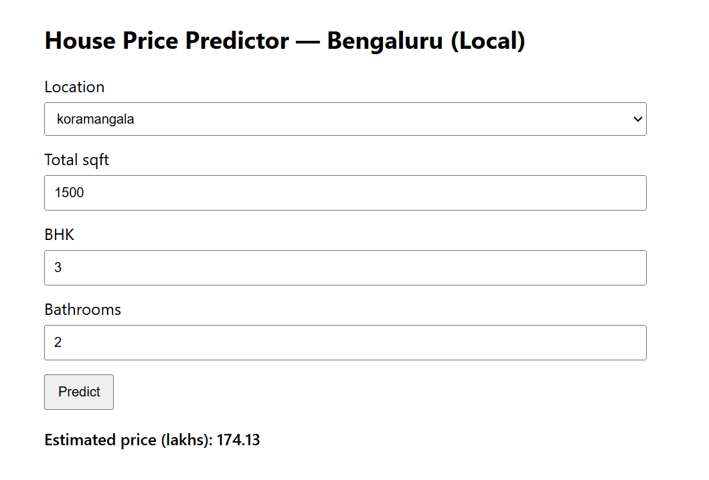

# House Price Prediction Web Application

This project implements an end-to-end machine learning pipeline for predicting house prices using scikit-learn and deploys the trained model through a Flask web interface.

## Features

- Data preprocessing and feature engineering
- Model training pipeline
- Serialized ML model for inference
- Flask backend API
- HTML front-end for real-time predictions

## Project Structure

artifacts/ → Saved trained model and feature metadata  
data/ → Dataset used for training  
training/ → Model training pipeline  
templates/ → HTML interface  
app.py → Flask backend server  
utils.py → Helper functions

## Running the Project

Install dependencies
pip install -r requirements.txt

Run the Flask server
python app.py

Open browser
http://127.0.0.1:5000

## System Architecture

The system follows a simple end-to-end machine learning deployment pipeline:

Data → Training Pipeline → Model Serialization → Flask API → Web Interface

1. **Training Stage**
   - Dataset loaded from `data/bengaluru_house_prices.csv`
   - Feature preprocessing performed
   - Model trained using scikit-learn
   - Artifacts saved to `artifacts/`

2. **Model Artifacts**
   - `bengaluru_house_price_model.pickle` → serialized trained model
   - `bengaluru_house_price_columns.json` → feature schema for inference

3. **Inference Layer**
   - Flask server (`app.py`) loads model artifacts
   - Prediction endpoint processes user input

4. **User Interface**
   - HTML template (`templates/index.html`)
   - Sends form inputs to Flask backend
   - Displays predicted house price

## Training the Model

To retrain the model using the dataset:
python training/model-training.py

This will:
- Load the dataset
- Train the regression model
- Save the trained model to `artifacts/bengaluru_house_price_model.pickle`
- Save feature metadata to `artifacts/bengaluru_house_price_columns.json`

## Demo

 

## Tech Stack

- Python
- scikit-learn
- Flask
- Pandas
- NumPy
Install dependencies
